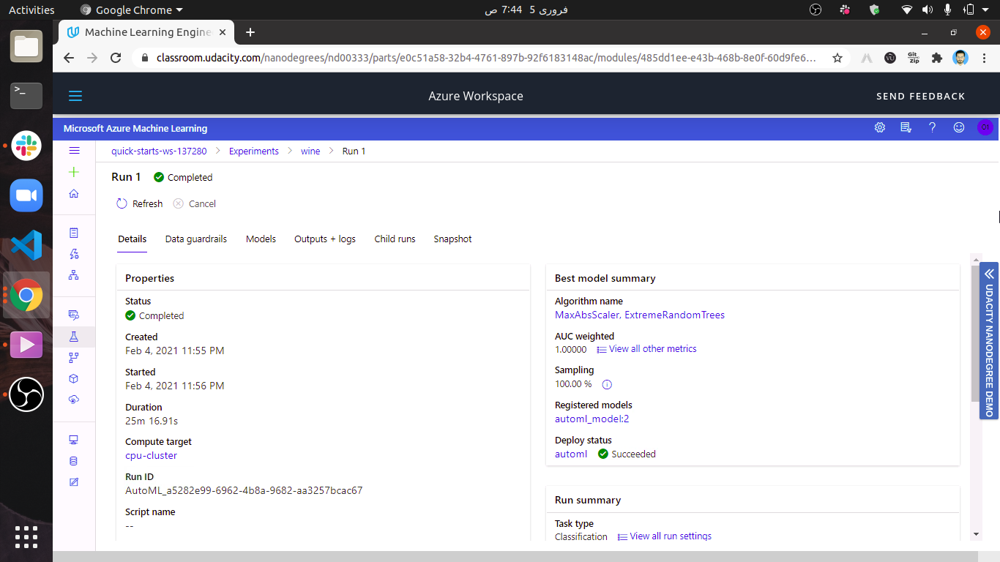

# Capstone Project: Wine Class Prediction using Azure ML

This project aims to create a web service endpoint for Hyperdrive and AutoML models trained using the Azure ML SDK. The model with best accuracy is then deployed and consumed.

## Dataset

### Overview
The dataset chosen for this project can be found at https://archive.ics.uci.edu/ml/datasets/wine

These data are the results of a chemical analysis of wines grown in the same region in Italy but derived from three different cultivars. The analysis determined the quantities of 13 constituents found in each of the three types of wines. The output will be either 1, 2, or 3 representing the corresponding type of wilne.

### Task
The purpose of this project will be to work on an external dataset of choice, in this case, the Wine dataset. Using Azure ML SDK, the data will be used to train different HyperDrive and AutoML models. The job is a classification type task, and the model that performs the best in terms of accuracy will be deployed as a web service on Azure. The resulting endpoint will be then be consumed.

In the case of HyperDrive, a Logistic Regression classifier will be utilized.

### Access
For ease of access, the data has been uploaded to this repository itself, and is brought into the Azure environment using the following code:
```python
dataset_url = "https://raw.githubusercontent.com/alihussainia/Azure3/main/wine.csv"
ds = TabularDatasetFactory.from_delimited_files(path =dataset_url)
dataset = ds.register(workspace = ws,
                      name = key,
                      description = description_text)
```

The registered dataset in Azure ML Studio - 


## Automated ML
The settings for the AutoML run are as follows - 
* Experiment Timeout - This is set to a period of 60 minutes, which is sufficient time to get a model with satisfactory accuracy.
* Maximum Concurrent Iterations - The number of runs that can be processed concurrently. This value cannot be greater than the maximum number of nodes in the compute cluster to be utilized.
* Primary Metric - This is set as accuracy.
* A Computer target is also specified for running the experiment
* Task - This is set as Classification, since we wish to predict the class of wine based on certain winery features.
* Training Data - Chosen as the Wine dataset from UCI Website.
* Label Column Name - Specified as "Name", and has 3 values (1s,2s and 3s)
* Model Explainability is set to True.
* Early Stopping has been enabled to ensure the experiment does not run for a long time.
* Featurization is set to "auto"
* The number of cross validations is set to 3

### Results
Among the many models trained during the AutoML run, one of the best performing model was the MaxAbsSacaler, SGD Models, which gave an weighted accuracy of 1 and accuracy of 0.983.

Below is a screenshot of the run details-




Some models trained by AutoML -


The  AutoML model - 


Additionally, the feature importance was also observed by setting model explainability to true while submitting the AutoML run.


### Future Improvements
* Utilization of deep learning algorithms to achieve better performance
* Increasing experiment timeout
* Eliminating models with poor performance from list of algorithms to be used
* Utilizing a metric other than Accuracy to measure performance.

## Hyperparameter Tuning
The model being used for the Hyperdrive run is a Logistic Regression model from the SKLearn framework that will help predict type of wine. The hyperparameters chosen to be fine tuned are:
* Inverse of Regularization Strength "C" - This parameter was randomly sampled from a set of values (0.01, 0.1, 1, 10, 100, 1000). The C parameter controls the penalty strength, which can be effective for preventing overfitting and ensure a better generalized performance of the model.
* Maximum Iterations "max_iter"- This parameter was randomly sampled from a set of values (25, 50, 100, 150, 250). It is the Maximum number of iterations taken to converge.

In this experiment, we find that different combinations of values from the above stated parameters present us with varying levels of accuracy.

The Hyperdrive run also involves other configuration settings like an early termination policy (Bandit), a compute target to run the experiment, a primary metric for evaluation (Accuracy in this case), and maximum number of runs (20).


### Results
The best model during the HyperDrive Run was a Logistic regression model with C = 100 and max_iter = 100. The accuracy of this model is 0.1.

Below is a screenshot of the run details widget -


Visual Representations of the HyperDrive Run - 


Models generated during HyperDrive run -


The best HyperDrive model -


### Future Improvements
* Implementing other classifiers like SVM, Random Forest, etc
* Using a more finely tuned random sampler for 'C' in HyperDrive
* Increasing maximum total runs
* Modifying primary metric from Accuracy to something else, like AUC Weighted


## Model Deployment
AutoMl run produces a best model with an accuracy of 0.78, which is lower than the accuracy of the best model as produced by the HyperDrive run, which is 0.82.

Hence, the best model from the HyperDrive run is registered in the workspace.


The registered model is then deployed in an endpoint that can be accessed using the a REST API that looks something like this:

 http://XXXXXXXX-XXXX-XXXX-XXXX-XXXXXXXXXXXX.southcentralus.azurecontainer.io/score

The deployed service can be now observed in the workspace under endpoints, with a 'Healthy' status - 


The input to be provided to the above endpoint should be in the JSON format. For Eg. - 
```
"data":
        [
            {
                "Pregnancies": 6,
                "Glucose": 148,
                "BloodPressure": 72,
                "SkinThickness": 35,
                "Insulin": 0,
                "BMI": 33.6,
                "DiabetesPedigreeFunction": 0.627,
                "Age": 50
            }
        ]
```

To query the endpoint using above data - 
```python
import requests
import json

scoring_uri = 'http://01b44a8b-d762-47c0-af37-16bc6cdf52aa.southcentralus.azurecontainer.io/score'

data = { "data":
        [
            {
                "Pregnancies": 6,
                "Glucose": 148,
                "BloodPressure": 72,
                "SkinThickness": 35,
                "Insulin": 0,
                "BMI": 33.6,
                "DiabetesPedigreeFunction": 0.627,
                "Age": 50
            }
        ]
       }

input_payload = json.dumps(data)
headers = {'Content-Type': 'application/json'}
response = requests.post(scoring_uri, input_payload, headers=headers)
print(response.json())
```

As a response, we receive either a 1 , 2, or 3, representing the predictions that the based on the inpute features which wine category should be classified.

## Screen Recording
https://youtu.be/BlVoA5Lf6HM

## Standout Suggestions
In addition to the project requirements, some additional features from standout suggestions were also implemented.

1. Enabling logging for the deployed webservice: This was done using the following code snippet -
```
service.update(enable_app_insights=True)
```

This can then be confirmed by viewing the settings of the deployed endpoint from Azure Machine Learning Studio.


2. Exporting the model to ONNX format: This was done using the following code snippet -
```
from skl2onnx import convert_sklearn
import onnxmltools
from onnxmltools import convert_sklearn
from onnxmltools.utils import save_model
from onnxmltools.convert.common.data_types import *
lr_model = joblib.load('model.joblib')
initial_type = [('float_input', FloatTensorType([1, 4]))]
onnx_model = onnxmltools.convert_sklearn(lr_model,initial_types=initial_type)
save_model(onnx_model, "model.onnx")
```

As a result, a model.onnx file is generated.

